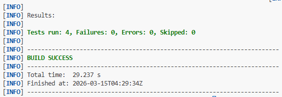
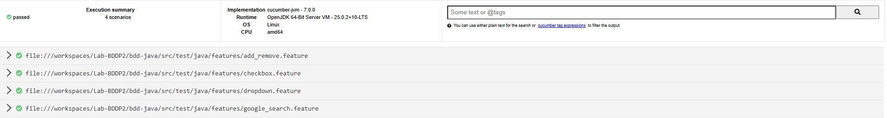

# Laboratorio BDD Parte 2

## Descripción del laboratorio
En esta segunda parte del laboratorio se implementaron varias pruebas automatizadas utilizando la metodología **BDD (Behavior Driven Development)** en Java.

A diferencia de la primera parte, donde solo se probaba una búsqueda en Google, en esta implementación se agregaron más escenarios de prueba para diferentes funcionalidades de una aplicación web, como selección de **checkboxes**, uso de **dropdowns** y manejo de **elementos dinámicos**.

## Implementación
En esta parte del laboratorio se organizaron las pruebas utilizando el patrón **Page Object**, creando clases que representan cada página de la aplicación. En estas clases se definen los elementos y las acciones que se pueden realizar, lo que permite separar la lógica de automatización de los escenarios definidos en Cucumber.

Se implementaron escenarios para probar diferentes interacciones en la página web, como:

- Búsqueda en Google  
- Selección de checkboxes  
- Selección de opciones en un dropdown  
- Agregar elementos dinámicamente en la página  

## Metodología
Para desarrollar la solución se realizaron los siguientes pasos:

1. Crear los escenarios de prueba en archivos `.feature` usando Gherkin.  
2. Implementar los **Step Definitions** en Java utilizando Selenium WebDriver.  
3. Crear las clases **Page Object** para manejar los elementos de cada página.  
4. Ejecutar las pruebas con Maven utilizando el comando: mvn test 

## Tecnologías utilizadas
- Java  
- Maven  
- Cucumber  
- Selenium WebDriver  
- JUnit  
- ChromeDriver  

## Resultado de la ejecución
Las pruebas se ejecutaron correctamente y todos los escenarios pasaron sin errores.

